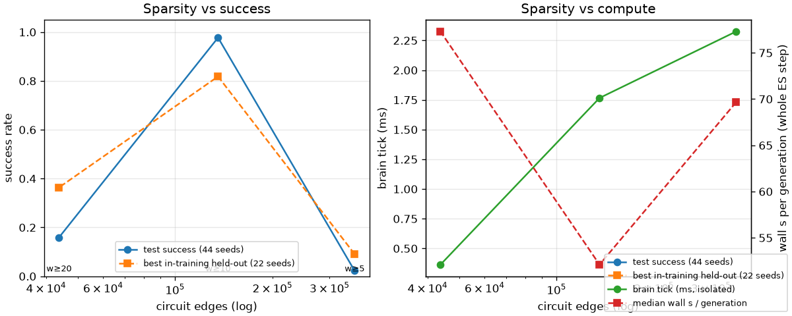
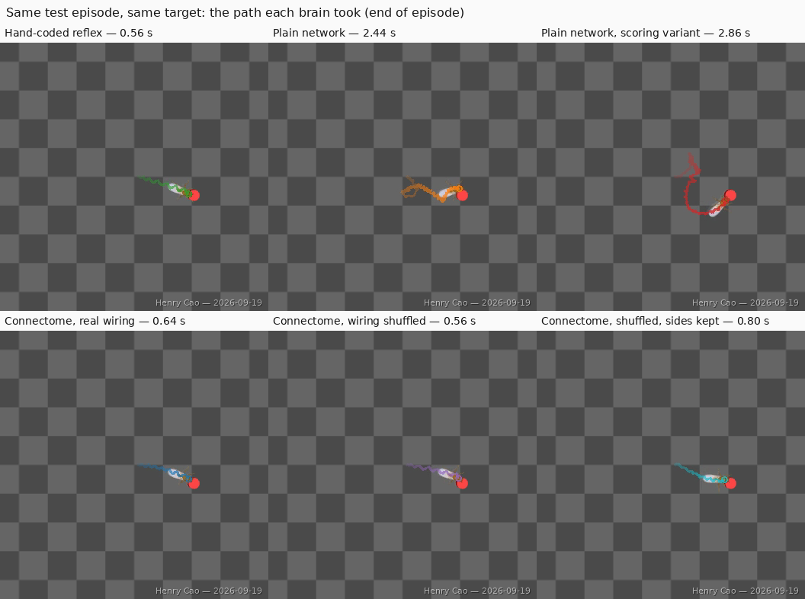

# Digital Fly: does real neural wiring help a simulated fly navigate?

A fruit fly's nervous system has been mapped connection by connection. I wanted to know
whether that map is *useful* as the control system of a walking robot-fly, or whether an
ordinary artificial network of the same size does just as well.

So I took an open-source physics simulation of a fruit fly, NeuroMechFly v2, left its body
and walking machinery completely untouched, and swapped in different "brains" between what
the fly senses and how it drives its legs. One of those brains routes its signals through
wiring copied from a real fly nerve-cord connectome. Then I trained them all the same way
and gave them the same navigation test: walk to a target that can appear in any direction.

**This folder is for feedback, so it has the write-up, the charts and some clips, but not
the implementation code.**

## How it works

See [pipeline.md](pipeline.md) for the one-picture version. In short: the simulator
reports what the fly can sense, my brain turns that into a walking command for each side
of the body, the simulator's own controller turns that into leg motion and physics, the
fly moves, repeat. Training is evolutionary: many slightly different brains are tried each
round, the better ones shape the next round. Nothing about steering is hand-programmed.

## Results

Full version with tables and caveats: [findings.md](findings.md).

Success out of 44 fresh test episodes per brain, all scored on the same episodes:

**1. The connectome brain learned to steer; the plain network never did.** It turns toward
the target, while the plain network spins at a constant rate and sweeps until it stumbles
onto it, taking about twice as long. The learning curves show it reaching a good policy
earlier and holding it:

**2. What helps is the connectome's left/right organisation, not its exact wiring.**
Randomly re-drawing connections *within* each side cost nothing and generalised best of
all (44/44 on far targets). Re-drawing them *across* sides is what broke steering: that
version reached nothing for the first two thirds of training (the flat line above).

**3. Circuit size has a sweet spot.** Both a denser and a sparser version of the same
circuit did much worse on the same training budget, so "more connectome" is not
automatically better:

**4. One obstacle breaks every learned brain** (down to 11–30% success) while the
hand-written reflex keeps 68%, because it re-aims after each bump:

An iteration that *failed* is written up too: I tried one change to fix the fly reaching
targets backwards. It fixed the backwards walking and made performance slightly worse.

## Watch the results

Every clip below is the *finished* brain (the same checkpoint that was scored on the test
set) running one and the same test episode: standard task, no obstacles, identical target,
seed 20000000. Each folder holds `topdown.mp4` (whole arena, the red disc is the target)
and `fly_follow.mp4` (camera tracking the fly). Times are for that single episode; the
44-episode averages are in the table in [findings.md](findings.md).

Each clip draws the fly's **path as a coloured trail** that grows as it walks, so you can
see the route at a glance and compare shapes between brains. The end-of-episode paths side
by side:

The straighter the trail, the better the brain is at heading for the target rather than
searching for it. Every clip is watermarked.

| clip | brain | what it shows |
|---|---|---|
| [videos/hand_coded_reflex/](videos/hand_coded_reflex/) | steering rule written by hand | green trail — the ceiling: straight at the target, 0.56 s |
| [videos/plain_network/](videos/plain_network/) | ordinary artificial network | orange trail — gets there, but loops round and arrives backwards, 2.44 s |
| [videos/plain_network_scoring_variant/](videos/plain_network_scoring_variant/) | same, trained with the scoring change | red trail — faces forward now, but loops wider still, 2.86 s |
| [videos/connectome_real_wiring/](videos/connectome_real_wiring/) | **real fly nerve-cord wiring** | blue trail — turns toward the target and goes, 0.64 s |
| [videos/connectome_shuffled/](videos/connectome_shuffled/) | wiring randomly re-drawn | purple trail — quick on this easy one (0.56 s), weakest on the harder tests |
| [videos/connectome_shuffled_sides_kept/](videos/connectome_shuffled_sides_kept/) | re-drawn within each side | cyan trail — as good as the real wiring, 0.80 s |

Watching `plain_network` and `connectome_real_wiring` back to back is the quickest way to
see the difference in *how* they approach the target.

Any player works (`vlc`, `mpv`, or double-click). No clips exist for the denser and
sparser circuit variants: those were only ever evaluated headless.

## What I'd love feedback on

1. **Does the shuffled-wiring control convince you?** I compare real wiring against the
   same circuit with connections randomly re-drawn, in two flavours: fully shuffled, and
   shuffled but keeping left and right separate. Is that a fair test of "does the real
   wiring matter", or is there a better control?
2. **What generalisation test would you try next?** So far: targets further away than
   trained, and obstacles. Moving targets? Rough ground? Starting the fly tilted?
3. **The obstacle failure.** Every learned brain collapses when an obstacle appears, while
   the hand-written rule copes. Obvious fix is to train with obstacles, but is there
   something more interesting to try, and would training with obstacles cost the speed
   advantage on the open field?
4. **Is the headline claim overstated?** I claim the connectome brains "learned to steer"
   while the plain ones did not, based on how their turning tracks the target direction.
   Each brain was trained once. How much should that worry you?
5. **What is confusing?** If any chart or explanation does not land in 30 seconds, tell me,
   that is the most useful thing you can say before the fair.

## Reproducing it

[requirements.txt](requirements.txt) lists everything needed: the upstream simulator
(FlyGym / NeuroMechFly v2, Apache-2.0, referenced by pinned commit, not copied here), the
connectome data (MANC v1.0, Janelia, CC-BY 4.0, downloaded from Janelia's public bucket),
and standard scientific Python. Everything runs on a laptop CPU; no GPU is involved.

**Implementation code is not included here.** Happy to walk through it in person or demo
it live, the substance is there, it is just not something I want floating around before
judging.

## Credit where it is due

- **FlyGym / NeuroMechFly v2** — NeLy lab, EPFL (Apache-2.0). The fly body, physics,
  cameras and walking controller are theirs. Wang-Chen et al., *Nature Methods*, 2024.
- **MANC connectome** — Janelia FlyEM (CC-BY 4.0). Takemura et al. 2024; Marin et al.
  2024; Cheong et al. 2024.
- Mine: the brain in the middle, the experiments, and this write-up.

— Henry Cao, 2026-09-19. Project ID: henrycao-2026-f003b4
