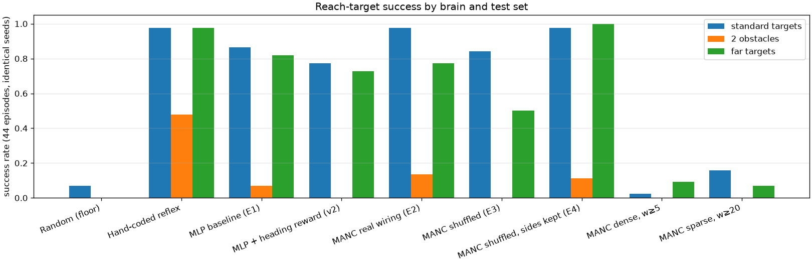

# What I tested and what I found

## The question

Does wiring copied from a real fly's nervous system help a simulated fly learn to walk to
a target, compared with an ordinary artificial network of similar size?

## What I compared

Every brain below was trained the same way, for the same number of practice episodes,
with the same starting layouts, and then scored on the same 44 fresh test episodes it had
never seen. In each episode the fly starts at the centre and a target appears 6–10 mm
away in a random direction, sometimes behind it. Reaching it within 3 simulated seconds
counts as a success.

| brain | what it is |
|---|---|
| Random | moves at random. The floor: anything must beat this. |
| Hand-coded reflex | I wrote the steering rule by hand. Nothing is learned. A practical ceiling. |
| Plain network | an ordinary small artificial network. The baseline. |
| Plain network, scoring variant | same, trained with one change to how it is scored (a deliberate design iteration). |
| **Connectome brain** | the real fly nerve-cord wiring in the middle of the loop. |
| Connectome, wiring shuffled | same circuit, connections randomly re-drawn. Control: does the real wiring matter? |
| Connectome, shuffled but sides kept | connections re-drawn *within* each side, so left stays left. Control: is it the wiring, or just the left/right layout? |
| Connectome, denser / sparser circuit | the same idea with more or fewer connections included. |

Two harder tests neither brain trained for: targets much further away, and obstacles in
the path.

## Pre-registered hypotheses

Written down before any of the learned results existed:

1. The plain network learns the task well above random.
2. The connectome brain learns the task too, and its steering has to come from the real
   left/right structure of the wiring.
3. Destroying the wiring structure makes steering worse.
4. Keeping the left/right layout but destroying the fine detail lands close to the real
   wiring, which would mean the layout is the useful part.
5. Obstacles hurt every brain that never trained with them.

## Headline results

Success out of 44 test episodes, and average time to reach the target:

| brain | standard targets | far targets | 2 obstacles | time to target |
|---|---|---|---|---|
| Random | 3/44 | 0/44 | 0/44 | – |
| Hand-coded reflex | 43/44 | 43/44 | **21/44** | **0.79 s** |
| Plain network | 38/44 | 36/44 | 3/44 | 2.01 s |
| Plain network, scoring variant | 34/44 | 32/44 | 0/44 | 2.06 s |
| **Connectome brain** | 43/44 | 34/44 | 6/44 | 1.24 s |
| Connectome, wiring shuffled | 37/44 | 22/44 | 0/44 | 2.06 s |
| **Connectome, shuffled, sides kept** | 43/44 | **44/44** | 5/44 | 1.04 s |
| Connectome, denser circuit | 1/44 | 4/44 | 0/44 | 2.98 s |
| Connectome, sparser circuit | 7/44 | 3/44 | 0/44 | 1.54 s |

**1. The connectome brain learned to steer. The plain network never did.** Looking inside
the episodes tick by tick, the connectome brains turn *toward* the target: the direction
they turn tracks where the target is. The plain networks do not. They spin at a roughly
constant rate and sweep until they bump into the target, which is why they take about
twice as long and walk curved paths. The success-rate gap on its own was not statistically
significant, but this difference in *how* they solve it is clear.

**2. What the connectome contributes here is its left/right organisation, not its exact
wiring.** Scrambling connections within each side cost nothing at all, and that version
generalised best of every learned brain (44/44 on far targets). Scrambling connections
*across* sides is what hurt: that brain reached nothing for the first two thirds of
training and generalised worst. The task really only needs "drive the left legs
differently from the right ones", and any wiring that keeps the sides separate can express
that. This does not mean the fine wiring is useless in general, only that this task does
not need it.

**3. Circuit size has a sweet spot.** Including more connections made it much worse
(1/44), not better, and including far fewer was also worse (7/44). More connectome is not
automatically better.

**4. A single obstacle breaks every learned brain.** They drop from 86–98% down to
11–30%, while the hand-written reflex keeps 68%. The reflex simply re-aims at the target
after being knocked off course. The learned brains have no recovery behaviour: obstacles
never moved during their training, so nothing ever pushed them to use that information.

## An iteration that did not work

I noticed the plain network was reaching targets *backwards*: it turned its back on the
target and reversed into it. I changed one thing about how training scores the fly to
discourage that, and retrained identically. It worked on the symptom, backwards walking
dropped from 56% of the time to 20%, but success got slightly *worse* and the paths got
*longer*. So backwards walking was not the real problem. The real problem, visible in
both versions, is that neither plain network ever learned to steer in a closed loop.
That is written up as a negative result rather than hidden.

## Honest caveats

- One training run per brain. Differences smaller than roughly 10 percentage points are
  not meaningful at 44 test episodes, and I say so wherever it applies.
- What the fly senses is given to it directly as geometry, not worked out from the
  simulated eyes.
- The connectome supplies steady left/right drive into the simulator's existing walking
  controller. It is not generating the leg rhythm itself, which a real nerve cord does.
- This is a simulation. Nothing here is a claim about live flies.

